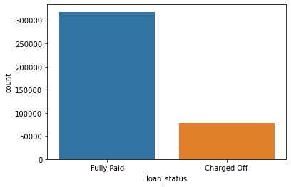
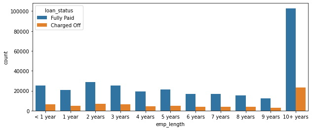
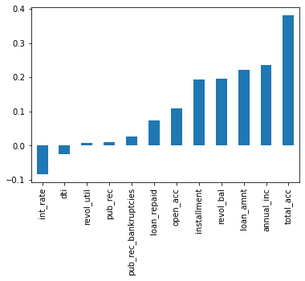

# LOAN-PAYMENT-PREDICTION

  First Header  | Second Header |
| ------------- | ------------- |
| loan_amnt  | The listed amount of the loan applied for by the borrower. If at some point in time, the credit department reduces the loan amount, then it will be reflected in this value  |
| term  | The number of payments on the loan. Values are in months and can be either 36 or 60  |
| int_rate  | Interest Rate on the loan  |
| installment  | The monthly payment owed by the borrower if the loan originates.  |
| grade  | LC assigned loan grade  |
| sub_grade  | LC assigned loan subgrade  |
| emp_title  | The job title supplied by the Borrower when applying for the loan.*  |
| emp_length  | Employment length in years. Possible values are between 0 and 10 where 0 means less than one year and 10 means ten or more years.  |
| home_ownership  | The home ownership status provided by the borrower during registration or obtained from the credit report. Our values are: RENT, OWN, MORTGAGE, OTHER  |
| annual_inc  | The self-reported annual income provided by the borrower during registration.  |
| verification_status  | Indicates if income was verified by LC, not verified, or if the income source was verified  |
| issue_d  | The month which the loan was funded  |
| loan_status  | Current status of the loan  |
| purpose  | A category provided by the borrower for the loan request.  |
| title  | The loan title provided by the borrower  |
| zip_code  | The first 3 numbers of the zip code provided by the borrower in the loan application.  |
| addr_state  | The state provided by the borrower in the loan application  |
| dti  | A ratio calculated using the borrower’s total monthly debt payments on the total debt obligations, excluding mortgage and the requested LC loan, divided by the borrower’s self-reported monthly income.  |
| earliest_cr_line  | The month the borrower's earliest reported credit line was opened  |
| open_acc  | The number of open credit lines in the borrower's credit file.  |
| pub_rec  | Number of derogatory public records  |
| revol_bal  | Total credit revolving balance  |
| revol_util  | Revolving line utilization rate, or the amount of credit the borrower is using relative to all available revolving credit.  |
| total_acc  | The total number of credit lines currently in the borrower's credit file  |
| initial_list_status  | The initial listing status of the loan. Possible values are – W, F  |
| application_type  | Indicates whether the loan is an individual application or a joint application with two co-borrowers  |
| mort_acc  | Number of mortgage accounts.  |
| pub_rec_bankruptcies  | Number of public record bankruptcies  |

This is a model that helps to predict whether or not a person will pay back their loan based on historical data, Tensor flow with keras API was used to develop the model.

EXPLORATORY DATA ANALYSIS

•	Used the Pandas info to do a quick exploration of the data which revealed that there are missing values in the data.

•	Performed a seaborn count plot to know how many loans were fully paid and charged off on our historical data.

•	Used seaborn’s distribution plot (kind = histogram) to graphically summarize the loan amount.

  
•	Used the correlation method to explore the correlation between the continuous numerical features, which showed that the most correlated are the loan amount and the installment payment.

 
•	Explored more on the two most correlated features with a scatter plot. To check out if both are not a duplication of the other.

 
•	Used a box plot to show the relationship between loan status and loan amount. Although both are quite similar, the plot still showed that that charged off loans are slightly higher than fully paid loans, which means that when the loan amount is slightly higher, there is a probability of the loan not being paid.

 
•	Performed further statistical summary on loan status and loan amount, by using a group by on the loan status and a describe method on the loan amount which showed that the mean and standard variation of charged off loans are higher than fully paid loans.

•	Explored the grade and subgrade features and realized the subgrade is a more detailed feature based on the grade.

•	Used a count plot to view the relationship between each grade and their loan status e.g., does grade A have more charge off than paid loan etc.

 
•	Performed a count plot on the sub grades and loan status which showed that as we move along the grades from A1-G5, the charge off seem to go higher.

•	The previous count plot does not show F and G in full detail, so I extracted the F and G subgrades only and did a count plot with loan status as its hue to show the subgrades F and G in full detail. Seems like the G subgrades hardly pay their loans.

 
•	Created a numeric feature ‘loan_repaid’ for ‘loan_status’, with 0 and 1 representing charged off and fully paid respectively.

•	Visualized the correlation between the new feature loan repaid and other numeric features, this showed that interest rate has the highest negative correlation which makes sense since the higher the interest rate the higher the chances of not paying the loan.

   
**DATA PREPROCESSING**

•	Used the isnull and sum method to view the summation of null values in each column.

•	Calculated the percentage of each columns null values to decide the null values / columns to be dropped or the ones to be retained. Emp_title(% 5.78), emp_length (% 4.62), title (% 0.44), revol_util (% 0.069), mort_acct (% 9.54) and pub_rec_bankruptcies (% 0.135).

•	Started examining emp_title & emp_length to decide if they are to be dropped or retained.

•	The emp_title has too many unique value data of over 170,000 which is simply unrealistic to be converted to dummy variables, so it has to be dropped.

•	Did a count plot on the unique values in the emp_length feature which showed that most loaners were in the category of 10+ years.

 
•	Added the loan status as a hue to display how each category of loaners years of working relates to the charged off and fully paid.
 

•	The graph above is not giving out a more detailed information we want, so we try calculating and using a bar chat to plot the percentage of charge offs per category, which showed that people who have worked 10 years and above have a slightly lower charged off rate percentage.

 
•	Explored the title and purpose column and realized they are both duplicates of one another, so I dropped the title column.

•	Using the value counts method on mort_acc shows that about %10 of mort_acc feature is null.

•	Decided to fill in the missing data in mort_acc with the average of the feature that is closely related to it, which was total_acc. Created a series total_acc_avg, method fill_mort_acc and used the apply method to fill in the missing values.

 
•	 Used the select_dtypes method to view all non-numeric columns in order to either delete or convert to dummy variables using one hot encoding.

•	Converted the string binary values of term variables to integers.

•	I dropped the grade variable since the sub grade variable is a more detailed form of the grade variable.

•	Converted the sub grade variable to dummy variables which was now concatenated with the main data frame.

•	Used one hot encoding to convert the remaining categorical or binary variables ('verification_status','application_type','initial_list_status','purpose').

•	Explored the home ownership variable and realized some categories were too small and had to be incorporated into another category e.g., ANY and NONE category were added to OTHER category.

•	Converted the remaining categories (MORTGAGE , RENT, OWN, OTHER) in the home ownership variable to dummy variables.

•	Explored the address column and realized the zip code could be extracted.

•	After extracting the zip-code, I performed one hot encoding on the new zip-code feature.

•	I went ahead and dropped the issue date due to the feature not having much relevance. Since we are predicting whether the loan will be paid or not, realistically, the loan issue date will not be available.

•	Extracted the year from the earliest_cr_line column.**

**DATA PREPROCESSING (TRAIN TEST SPLIT)**

•	Dropped the loan status since I already created a binary numeric corresponding feature for it (fully paid:1, charged off:0)

•	Created my output (y) and input variables (X) for my train test split.

•	Trained my input and output variables using the fit and transform method.

**MODEL CREATION AND TRAINING**

•	Imported tensor flow so as to use keras api for my model.

•	Built a sequential model while using a dense neuron and also added a drop out layer to prevent overfitting.

•	I assigned rectified linear unit as my activation function to my first and hidden layers while I assigned sigmoid function to the last layer since it was a classification model I am building.

•	I used binary cross entropy and adam for my loss and optimizer respectively.

•	Fitted the model to the training data in batches and also passes in validation data on the test data to check for overfitting.

**MODEL EVALUATION**
•	Plotted out the validation loss versus the training loss.

•	Used confusion matrix which showed over %85 of our predictions either fell under true positive or true negative while the classification report revealed that the predictions had an accuracy of over %80.

•	Used the model I created to run on a random person in the data to check its accuracy, the model predicted that the person would fully pay which is same with the initial data.
