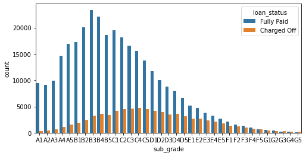

# LOAN-PAYMENT-PREDICTION

**Aim**

The repository contains a loan eligibility prediction based on the lending club dataset from [kaggle] (https://www.kaggle.com/wordsforthewise/lending-club). the goals of this project are:

•	Use of pandas, NumPy, matplotlib, & seaborn libraries from python to extract insights from the data.

•	Use of train test split function to split the dataset into two arrays input variable(X) and output variable (y).

•	Use a sequential model to build the neural network and Dense layer for how the layers will be connection.

•	Use of confusion matrix and classification report to evaluate our model.

**Dependencies**

•	NumPy
•	Pandas
•	Seaborn
•	Matplotlib
•	Scikit-Learn
•	TensorFlow
•	Keras

**Attributes**

  First Header  | Second Header |
| ------------- | ------------- |
| loan_amnt  | The listed amount of the loan applied for by the borrower. If at some point in time, the credit department reduces the loan amount, then it will be reflected in this value  |
| term  | The number of payments on the loan. Values are in months and can be either 36 or 60  |
| int_rate  | Interest Rate on the loan  |
| installment  | The monthly payment owed by the borrower if the loan originates.  |
| grade  | LC assigned loan grade  |
| sub_grade  | LC assigned loan subgrade  |
| emp_title  | The job title supplied by the Borrower when applying for the loan.*  |
| emp_length  | Employment length in years. Possible values are between 0 and 10 where 0 means less than one year and 10 means ten or more years.  |
| home_ownership  | The home ownership status provided by the borrower during registration or obtained from the credit report. Our values are: RENT, OWN, MORTGAGE, OTHER  |
| annual_inc  | The self-reported annual income provided by the borrower during registration.  |
| verification_status  | Indicates if income was verified by LC, not verified, or if the income source was verified  |
| issue_d  | The month which the loan was funded  |
| loan_status  | Current status of the loan  |
| purpose  | A category provided by the borrower for the loan request.  |
| title  | The loan title provided by the borrower  |
| zip_code  | The first 3 numbers of the zip code provided by the borrower in the loan application.  |
| addr_state  | The state provided by the borrower in the loan application  |
| dti  | A ratio calculated using the borrower’s total monthly debt payments on the total debt obligations, excluding mortgage and the requested LC loan, divided by the borrower’s self-reported monthly income.  |
| earliest_cr_line  | The month the borrower's earliest reported credit line was opened  |
| open_acc  | The number of open credit lines in the borrower's credit file.  |
| pub_rec  | Number of derogatory public records  |
| revol_bal  | Total credit revolving balance  |
| revol_util  | Revolving line utilization rate, or the amount of credit the borrower is using relative to all available revolving credit.  |
| total_acc  | The total number of credit lines currently in the borrower's credit file  |
| initial_list_status  | The initial listing status of the loan. Possible values are – W, F  |
| application_type  | Indicates whether the loan is an individual application or a joint application with two co-borrowers  |
| mort_acc  | Number of mortgage accounts.  |
| pub_rec_bankruptcies  | Number of public record bankruptcies  |

**Approach**

1. Exploratory Data Analysis: Used summary statistics and graphical representations to discover patterns or correlation among the variables in the data.

2. Data Preprocessing: Dropping unnecessary or repetitive features, dropping or filling any missing data and converting categorical string features to dummy variables.

3. Model Creation and Training: Built a sequential model to train the input (X) and output (y) variables.

4. Evaluating Model Performance: confusion matrix and classification report to evaluate our model, also plotted the validation loss versus the training loss.

**Major observation from the data**

1. Used the correlation method to explore the correlation between the continuous numerical features, which showed that the most correlated among the variables are the loan amount and the installment payment.

2. Explored more on the two most correlated features with a scatter plot. To check out if both are not a duplication of the other.

3. Used a box plot to show the relationship between loan status and loan amount. Although both are quite similar, the plot still showed that that charged off loans are slightly higher than fully paid loans, which means that when the loan amount is slightly higher, there is a probability of the loan not being paid.

4. Used a count plot to view the relationship between each grade and their loan status e.g., does grade A have more charge off than paid loan etc.

5. Performed a count plot on the sub grades and loan status which showed that as we move along the grades from A1-G5, the charge off seem to go higher.

6. The previous count plot does not show F and G in full detail, so I extracted the F and G subgrades only and did a count plot with loan status as its hue to show the subgrades F and G in full detail. Seems like the G subgrades hardly pay their loans.

7. Visualized the correlation between the feature loan status and other numeric features, this showed that interest rate has the highest negative correlation which makes sense since the higher the interest rate the higher the chances of not paying the loan.

8. Did a count plot on the unique values in the emp_length feature which showed that most loaners were in the category of people who have worked 10+ years.

9. The graph above is not giving out a more detailed information we want, so we try calculating and using a bar chat to plot the percentage of charge offs per category, which showed that people who have worked 10 years and above have a slightly lower charged off rate percentage.

