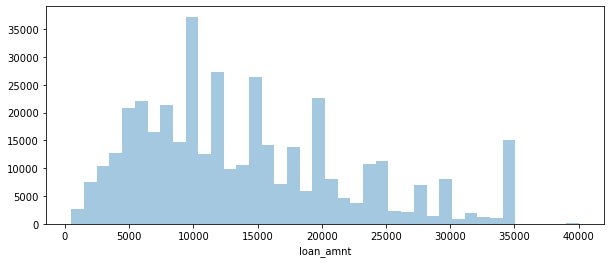

# LOAN-PAYMENT-PREDICTION

This is a model that helps to predict whether or not a person will pay back their loan based on historical data, Tensor flow with keras API was used to develop the model.

EXPLORATORY DATA ANALYSIS

•	Used the Pandas info to do a quick exploration of the data which revealed that there are missing values in the data.

•	Performed a seaborn count plot to know how many loans were fully paid and charged off on our historical data.

•	Used seaborn’s distribution plot (kind = histogram) to graphically summarize the loan amount.

  
•	Used the correlation method to explore the correlation between the continuous numerical features, which showed that the most correlated are the loan amount and the installment payment.

 
•	Explored more on the two most correlated features with a scatter plot. To check out if both are not a duplication of the other.

 
•	Used a box plot to show the relationship between loan status and loan amount. Although both are quite similar, the plot still showed that that charged off loans are slightly higher than fully paid loans, which means that when the loan amount is slightly higher, there is a probability of the loan not being paid.

 
•	Performed further statistical summary on loan status and loan amount, by using a group by on the loan status and a describe method on the loan amount which showed that the mean and standard variation of charged off loans are higher than fully paid loans.

